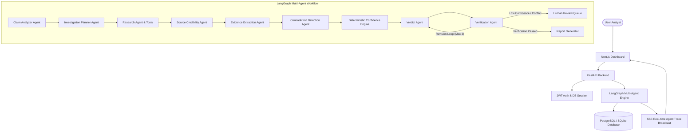

# TRUTHLENS AI
### Autonomous Multi-Agent LLM Misinformation Investigation & Fact Verification System

TruthLens AI is a production-grade, autonomous multi-agent misinformation investigation system powered by **FastAPI**, **LangGraph**, **PostgreSQL / SQLAlchemy**, and **Next.js**.

---

## 🚀 Why TruthLens AI is Genuinely Agentic

Unlike simple single-turn chatbot wrappers (`User -> LLM -> Answer`), TruthLens AI implements a dynamic, stateful multi-agent graph architecture capable of:
- **Dynamic Investigation Planning**: Formulates claim-specific search queries instead of static lists.
- **Autonomous Tool Execution**: Invokes web search, HTML parsing, metadata extraction, and report generators.
- **Untrusted Web Content Boundaries**: Implements strict Prompt Injection Defense by stripping system overrides from scraped web text.
- **Source Credibility Evaluation**: Scores authority, recency, domain reputation, and citation quality.
- **Evidence Stance & Contradiction Detection**: Identifies supporting, contradicting, and neutral evidence alongside methodological/date conflicts.
- **Deterministic Confidence Engine**: Calculates confidence using a weighted mathematical formula rather than LLM guesswork.
- **Verification & Revision Loops**: Verifies citations and checks for hallucinations, looping back to revise up to 3 times.
- **Human-in-the-Loop Review**: Triggers analyst review when confidence is low or evidence conflicts heavily.

---

## 🏗️ Architecture Overview



---

## 🤖 Agents & Tools

### Agent Modules
1. **Claim Analyzer Agent**: Deconstructs factual claim into entities, topic area, time sensitivity, and target research questions.
2. **Investigation Planner Agent**: Creates dynamic, claim-specific search strategy and queries.
3. **Research Agent**: Scrapes web content and enforces XML security boundaries against prompt injection attacks.
4. **Source Credibility Agent**: Evaluates 6 credibility metrics (authority, recency, primary nature, evidence quality, domain reputation, citation quality).
5. **Evidence Extraction Agent**: Extracts factual evidence items and assigns stance (`SUPPORTS`, `CONTRADICTS`, `NEUTRAL`).
6. **Contradiction Detection Agent**: Detects methodological, date, definition, and factual mismatches.
7. **Verdict Agent**: Reasons over structured evidence to formulate standard verdicts (`TRUE`, `MOSTLY TRUE`, `PARTIALLY TRUE`, `MISLEADING`, `MOSTLY FALSE`, `FALSE`, `UNVERIFIED`, `INSUFFICIENT EVIDENCE`).
8. **Verification Agent**: Verifies supported claims and checks for hallucinations before finalizing (max 3 retries).

---

## 🔢 Deterministic Confidence Engine

The system calculates confidence using a transparent weighted formula:

$$\text{Confidence} = 0.30 \cdot S_{\text{quality}} + 0.25 \cdot E_{\text{agreement}} + 0.20 \cdot E_{\text{strength}} + 0.10 \cdot R_{\text{recency}} + 0.10 \cdot S_{\text{indep}} - 0.05 \cdot P_{\text{contradiction}}$$

---

## 💻 Quick Start & Running Locally

### 1. Environment Setup
Copy the configuration template:
```bash
cp .env.example .env
```

### 2. Run with Docker Compose
```bash
docker-compose up --build -d
```
Access the application at:
- **Frontend Dashboard**: `http://localhost:3000`
- **Backend OpenAPI Docs**: `http://localhost:8000/api/docs`

### 3. Local Development Mode

#### Backend:
```bash
cd backend
pip install -r requirements.txt
uvicorn app.main:app --reload --port 8000
```

#### Frontend:
```bash
cd frontend
npm install
npm run dev
```

---

## 🧪 Testing & Evaluation

### Run Backend Unit & Integration Tests:
```bash
$env:PYTHONPATH='backend'; python -m pytest backend/tests
```

### Run Benchmark Evaluation Suite:
```bash
$env:PYTHONPATH='backend'; python evaluation/evaluate.py
```

---

## 🌟 Demo Mode

TruthLens AI includes a **DEMO_MODE** enabled by default. It allows the complete multi-agent workflow, real-time trace, interactive evidence graph, and report export to be demonstrated without external paid API keys.

Try running with claim:
> `"Artificial intelligence causes permanent memory loss."`

---

## 🔮 Future Work
- Integration with specialized biomedical databases (PubMed, ClinicalTrials.gov, ChEMBL).
- Support for multimodal claim analysis (image & video deepfake detection).
- Graph neural network integration for advanced entity link prediction.
