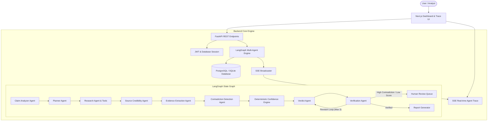

# TruthLens AI - Architecture Specification

## Overview
TruthLens AI is an autonomous multi-agent misinformation investigation system. Rather than relying on simple prompt-response interactions, it executes a multi-step LangGraph workflow with deterministic confidence calculations, dynamic plan generation, prompt injection defense, and human-in-the-loop review.

## Architecture Diagram

## Core Subsystems
1. **LangGraph State Orchestrator**: Manages state transitions, retries, conditional branches, and persistent execution history.
2. **Deterministic Confidence Engine**: Calculates confidence scores based on weighted factors rather than LLM guesswork.
3. **Prompt Injection Defense**: Sanitizes scraped content by stripping injection triggers and isolating untrusted content inside XML boundaries.
4. **Interactive Evidence Graph**: Produces node-edge representations (Claim -> Sources -> Evidence -> Verdict) with relationship stances.
5. **Report Generation Service**: Produces HTML & PDF report packages.
